# 🛒 FoodMart -MongoDB E-Ticaret Projesi

**FoodMart**, modern web teknolojileri kullanılarak geliştirilmiş, **MongoDB** tabanlı dinamik bir e-ticaret (Süpermarket) uygulamasıdır. **ASP.NET Core MVC** mimarisi üzerine inşa edilmiş olup, katmanlı mimari prensiplerine uygun olarak **Admin Paneli** ve **Vitrin (UI)** tarafını birbirinden ayırır.

Bu proje, statik bir HTML temasını dinamik, veritabanı destekli ve yönetilebilir bir web uygulamasına dönüştürme sürecini kapsar.

---

## 🚀 Temel Özellikler

### 🔹 Müşteri Arayüzü (Vitrin)
* **Dinamik Ana Sayfa:** Slider, Kategoriler ve Ürünler veritabanından (MongoDB) anlık çekilir.
* **ViewComponent Mimarisi:** Sayfa parçaları (Trend Ürünler, En Çok Satanlar, Etiketler) bağımsız ve tekrar kullanılabilir bileşenler olarak tasarlanmıştır.
* **Gelişmiş Ürün Listeleme:** Kategorilere göre filtreleme veya tüm ürünleri listeleme.
* **Bülten Aboneliği:** Kullanıcı mail adresiyle abone olduğunda **SMTP (MailKit)** üzerinden otomatik %25 indirim kuponu gönderilir.

### 🔹 Yönetim Paneli (Admin)
* **Güvenli Giriş Sistemi:** `AspNetCore.Identity.MongoDbCore` ile güvenli Admin Login/Register işlemleri.
* **CRUD İşlemleri:**
    * **Ürün Yönetimi:** Ürün ekle, sil, güncelle, listele.
    * **Kategori Yönetimi:** Kategori işlemleri.
    * **Slider & Özellikler:** Ana sayfa manşet ve "İnsanlar Bunları Arıyor" etiketlerinin yönetimi.
* **Modern Admin Teması:** **Spike Tailwind CSS Admin Template** entegrasyonu ile şık ve kullanıcı dostu panel.

---

## 🛠️ Mimari ve Kullanılan Teknolojiler

Projenin altyapısı, performans, ölçeklenebilirlik ve temiz kod prensipleri gözetilerek oluşturulmuştur. Aşağıda projede kullanılan temel teknolojiler ve kullanım amaçları detaylandırılmıştır:

### 🖥️ Backend (Sunucu Tarafı)
Projenin temelinde, Microsoft'un açık kaynaklı ve çapraz platform destekli **ASP.NET Core MVC (6.0/8.0)** framework'ü yer almaktadır. Kodun sürdürülebilirliğini sağlamak adına **N-Tier (Katmanlı Mimari)** yapısı benimsenmiş; Entity, Data Access, Business ve UI katmanları mantıksal olarak ayrılmıştır.

### 🗄️ Veritabanı (Database)
Klasik ilişkisel veritabanları yerine, büyük veri yönetimi ve esnek şema yapısı sunan NoSQL teknolojisi **MongoDB** tercih edilmiştir. Veritabanı ile iletişim, **MongoDB.Driver** kütüphanesi üzerinden sağlanmaktadır.

### 🔐 Güvenlik ve Kimlik Doğrulama
Kullanıcı yönetimi ve admin paneli güvenliği için **AspNetCore.Identity.MongoDbCore** kütüphanesi entegre edilmiştir. Bu sayede, Identity mekanizmasının sağladığı güçlü güvenlik özellikleri (Login, Register, Role Management) MongoDB üzerinde sorunsuz çalışmaktadır.

### 🎨 Frontend (Arayüz)
* **Müşteri Tarafı:** Kullanıcı dostu ve mobil uyumlu bir deneyim için **Bootstrap 5** grid sistemi, **HTML5** ve **CSS3** kullanılmıştır. Ürün kaydırma efektleri için **SwiperJS** kütüphanesinden yararlanılmıştır.
* **Admin Tarafı:** Yönetim panelinde modern ve şık bir görünüm elde etmek için **Tailwind CSS** tabanlı **Spike Admin Template** projeye entegre edilmiştir.

### 🔧 Yardımcı Araçlar ve Kütüphaneler
* **AutoMapper:** Entity ve DTO (Data Transfer Object) nesneleri arasındaki veri transferini otomatikleştirmek için kullanılmıştır.
* **MailKit:** Bülten aboneliği gibi e-posta gönderim işlemleri için .NET'in en güçlü mail kütüphanesi olan MailKit (SMTP) tercih edilmiştir.

---

## 📸 Proje Arayüzü ve Özellikler

Uygulamanın modern ve kullanıcı dostu arayüzünden kareler:

  <h3>🛒 Vitrin (Müşteri Arayüzü)</h3>
  
Kullanıcıların ürünleri incelediği, dinamik slider ve kategori alanlarına sahip ana sayfa.

  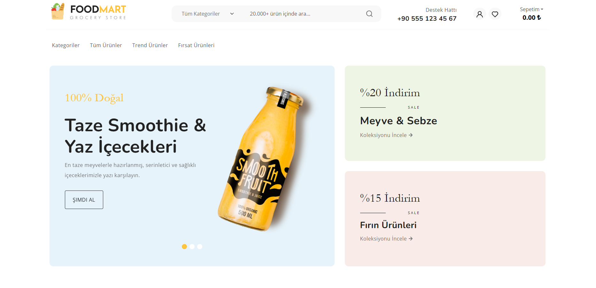
    

  <h3>🛍️ Ürün Detay & Sepet</h3>
  
Hızlı sepete ekleme, detaylı ürün inceleme ve dinamik sepet yönetimi.

  <table align="center">
    <tr>
      <td>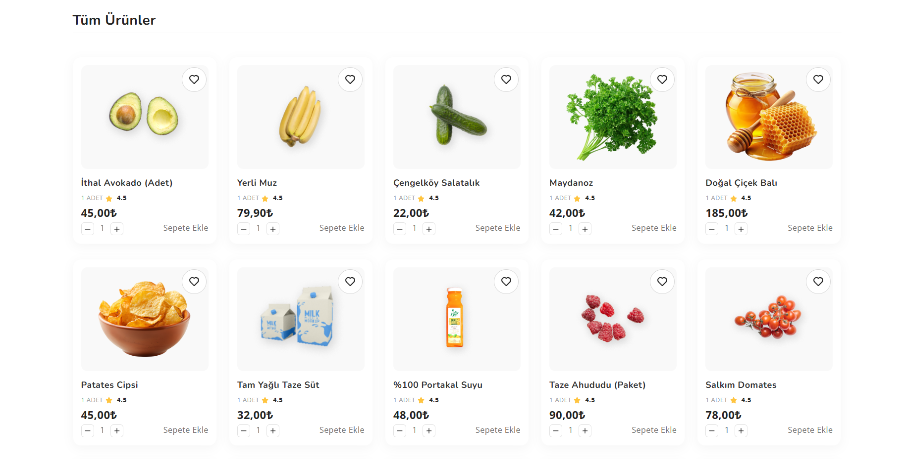</td>
      <td>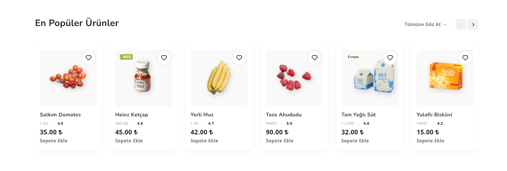</td>
    </tr>
  </table>

   
 

  <h3>🔐 Yönetici Paneli (Admin Dashboard)</h3>
  
Spike Tailwind teması ile güçlendirilmiş, modern ve responsive yönetim paneli.

  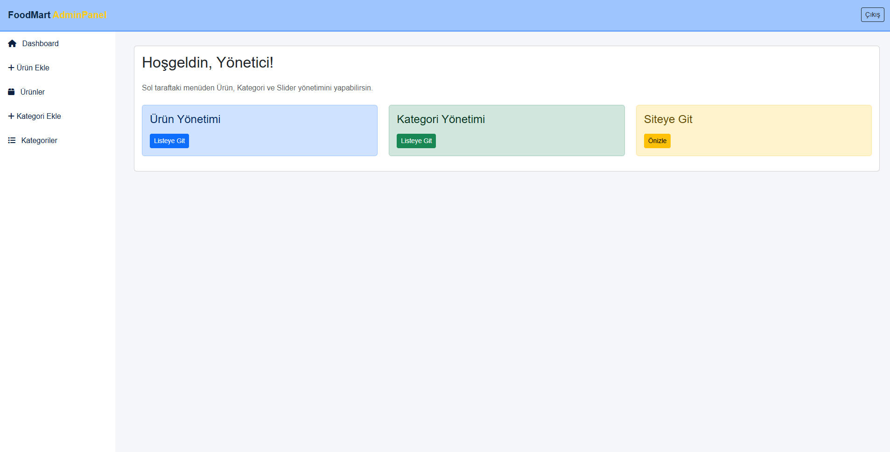
    

  <h3>📦 Ürün & Kategori Yönetimi</h3>
  
Admin panelinden kolayca ürün ekleme, güncelleme ve stok takibi işlemleri.

  <table align="center">
    <tr>
      <td>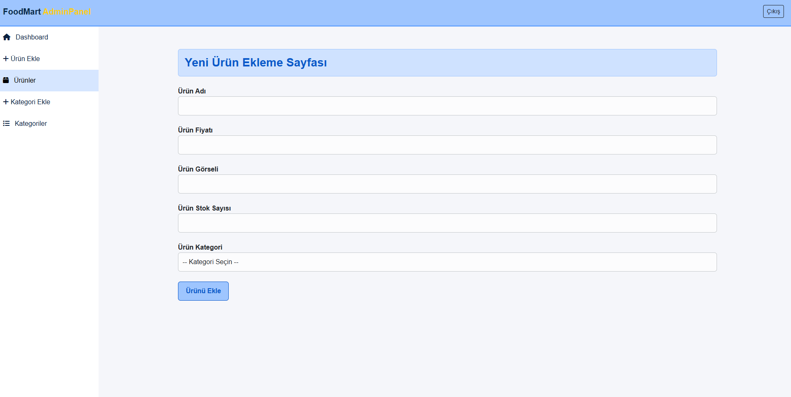</td>
      <td>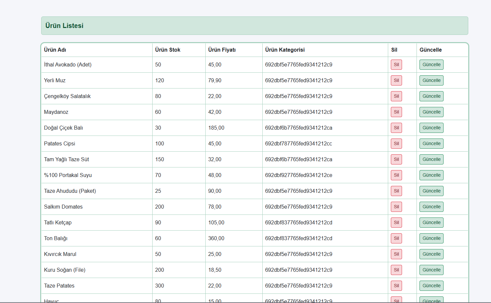</td>
    </tr>
  </table>
   
  <table align="center">
    <tr>
      <td>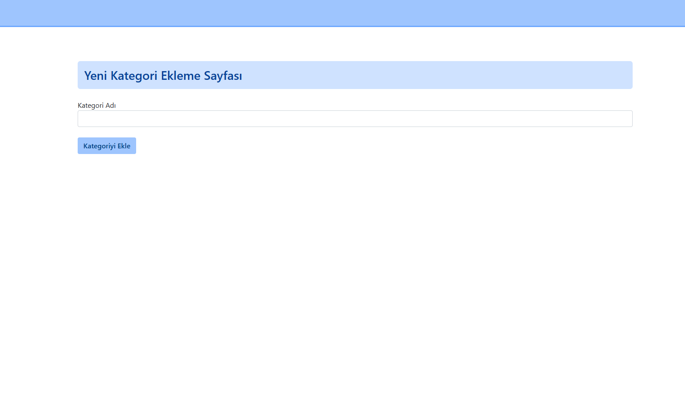</td>
      <td>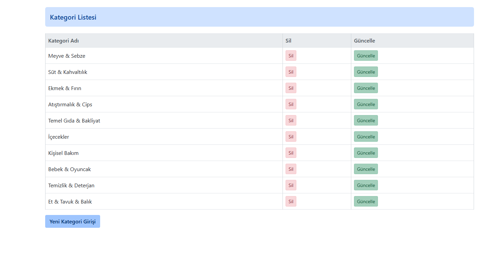</td>
    </tr>
  </table>

   
 

  <h3>🔑 Güvenlik & Giriş</h3>
  
MongoDB Identity altyapısı ile güvenli Admin giriş ve kayıt ekranları.

  <table align="center">
    <tr>
      <td>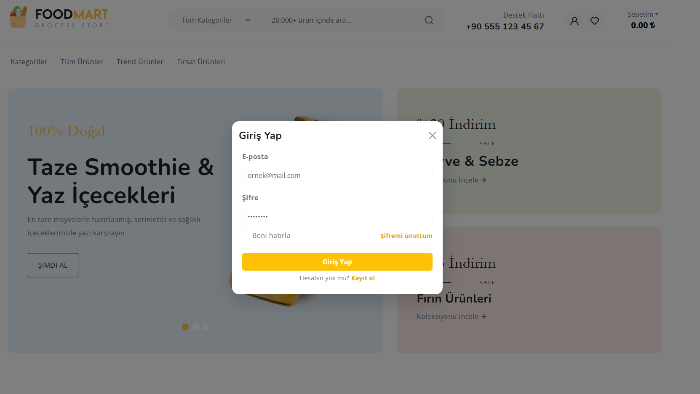</td>
      <td></td>
    </tr>
  </table>

   
 

  <h3>✉️ Bülten & İletişim</h3>
  
Kullanıcıların mail bültenine abone olması ve otomatik indirim kodu gönderimi.

  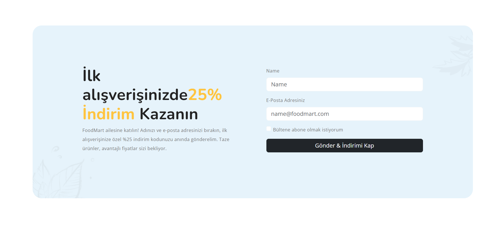
   
  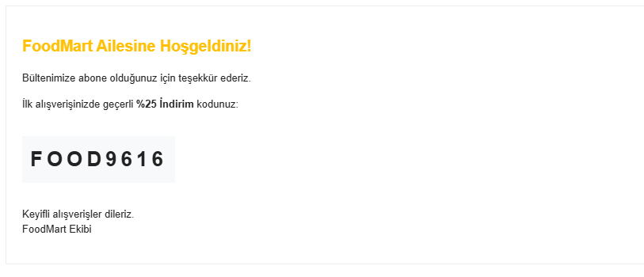

