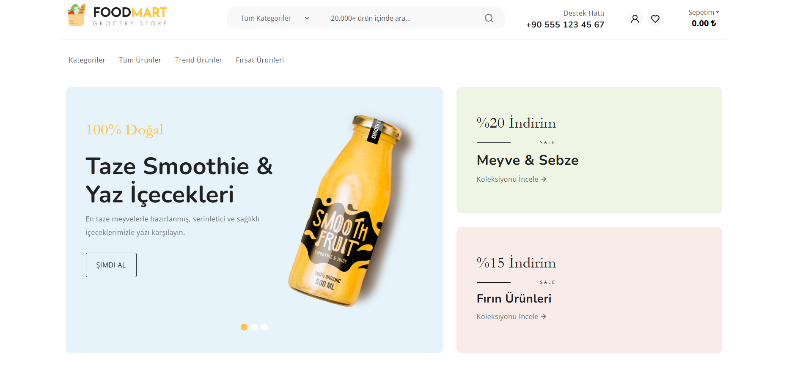
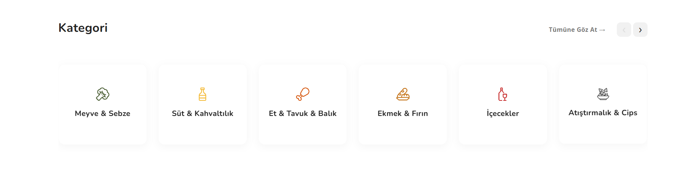
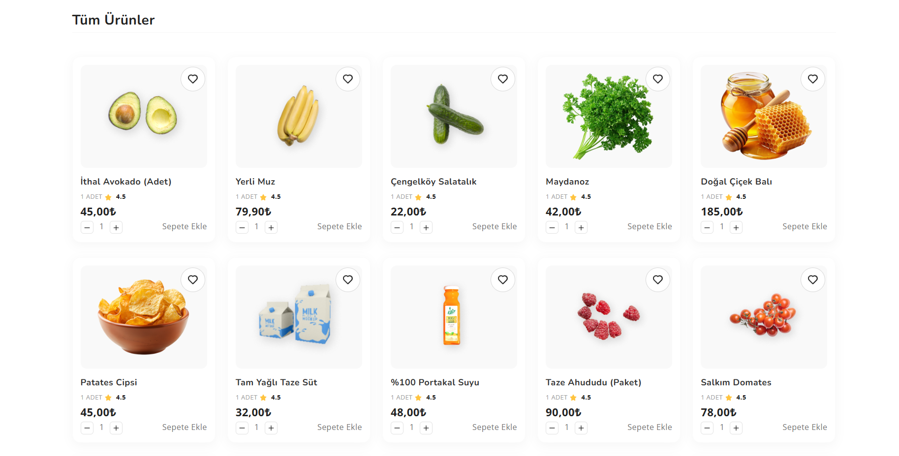
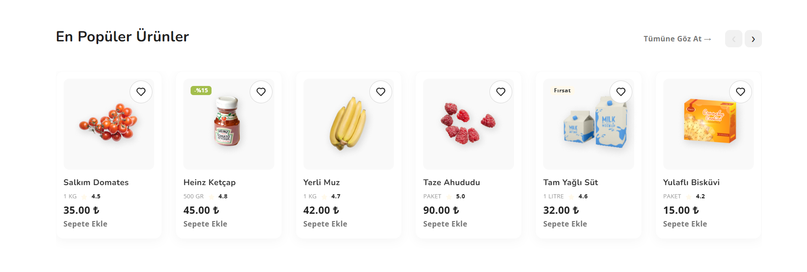
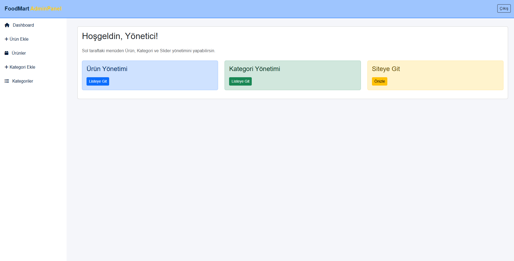
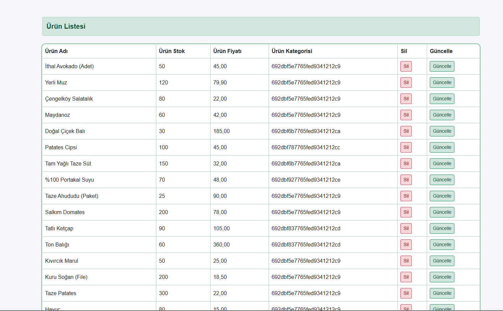
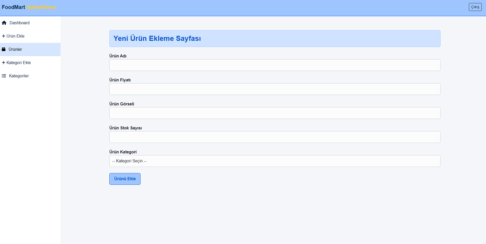
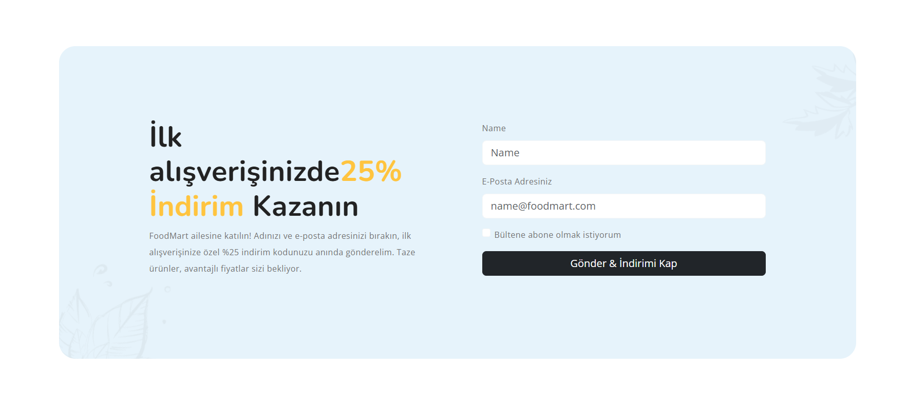
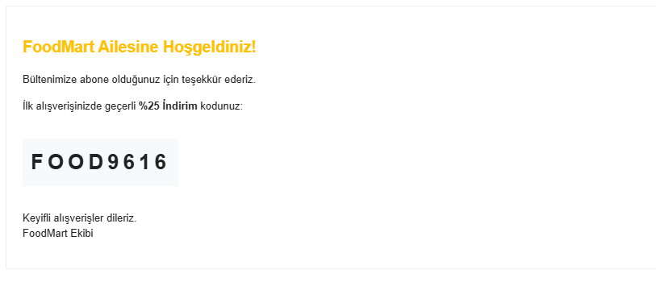

# FoodMartMongo

FoodMartMongo is an ASP.NET Core MVC supermarket/e-commerce application built with MongoDB. It turns a static FoodMart-style UI template into a dynamic, database-driven web application with customer-facing pages and admin-oriented management screens.

The project demonstrates MongoDB usage in a .NET MVC application, service-based structure, DTO usage, AutoMapper, ViewComponents, admin panel screens, and SMTP-based newsletter discount email flow.

## Features

### Customer UI

- Dynamic homepage content
- Dynamic category listing
- Product listing by categories
- Popular, trending, discounted, and best seller product sections
- Reusable ViewComponents for homepage sections
- Newsletter subscription flow
- Discount code email sending with SMTP/MailKit
- Responsive supermarket-style UI

### Admin / Management Screens

- Admin dashboard page
- Product CRUD operations
- Category CRUD operations
- Feature/slider content management
- Tailwind-based admin panel template integration

## Tech Stack

- ASP.NET Core MVC 8.0
- C#
- MongoDB
- MongoDB.Driver
- DTO pattern
- Service layer structure
- AutoMapper
- MailKit / SMTP
- Razor Views
- ViewComponents
- HTML5, CSS3, Bootstrap
- Tailwind-based admin template

## Project Structure

```text
FoodMartMongo/
├── FoodMartMongo.sln
├── FoodMartMongo/
│   ├── Controllers/
│   ├── Dtos/
│   ├── Entities/
│   ├── Mapping/
│   ├── Services/
│   ├── Settings/
│   ├── ViewComponents/
│   ├── Views/
│   ├── wwwroot/
│   ├── Program.cs
│   ├── appsettings.json
│   └── FoodMartMongo.csproj
├── ımages/
└── README.md
```

## Requirements

Before running the project, make sure the following tools are installed:

- .NET 8 SDK
- MongoDB Community Server or Docker
- Visual Studio 2022 or Visual Studio Code
- Optional: MongoDB Compass for viewing collections

## Configuration

MongoDB settings are defined in:

```text
FoodMartMongo/appsettings.json
```

Default MongoDB configuration:

```json
"DatabaseSettingsKey": {
  "ConnectionString": "mongodb://localhost:27017",
  "DatabaseName": "FoodMartDB",
  "CategoryCollectionName": "Categories",
  "ProductCollectionName": "Products",
  "CustomerCollectionName": "Customers",
  "DiscountCollectionName": "Discounts",
  "SliderCollectionName": "Sliders",
  "FeatureCollectionName": "Features"
}
```

If MongoDB runs locally on the default port, this configuration works as-is.

## Running MongoDB with Docker

If you do not have MongoDB installed locally, you can run it with Docker:

```bash
docker run --name foodmart-mongo -p 27017:27017 -d mongo:7
```

Check that the container is running:

```bash
docker ps
```

## Mail Settings

The newsletter feature sends a discount code using SMTP. The repository contains placeholder mail values in `appsettings.json`.

For local testing, use .NET user secrets instead of committing real credentials:

```bash
dotnet user-secrets init --project FoodMartMongo/FoodMartMongo.csproj
```

Set SMTP values:

```bash
dotnet user-secrets set "MailSettings:Mail" "your-email@example.com" --project FoodMartMongo/FoodMartMongo.csproj
dotnet user-secrets set "MailSettings:Password" "your-app-password" --project FoodMartMongo/FoodMartMongo.csproj
dotnet user-secrets set "MailSettings:DisplayName" "FoodMart Discount" --project FoodMartMongo/FoodMartMongo.csproj
dotnet user-secrets set "MailSettings:Host" "smtp.gmail.com" --project FoodMartMongo/FoodMartMongo.csproj
dotnet user-secrets set "MailSettings:Port" "587" --project FoodMartMongo/FoodMartMongo.csproj
```

If you do not configure SMTP credentials, avoid testing the newsletter email send action.

## How to Run

Clone the repository:

```bash
git clone https://github.com/FatmaBuseBorlu/FoodMartMongo.git
```

Navigate into the project folder:

```bash
cd FoodMartMongo
```

Restore dependencies:

```bash
dotnet restore
```

Make sure MongoDB is running, then run the application:

```bash
dotnet run --project FoodMartMongo/FoodMartMongo.csproj
```

Open the application in your browser using the localhost URL shown in the terminal.

## Main Routes

```text
/Home/Index              Customer-facing homepage
/Admin/Dashboard         Admin dashboard
/Category/CategoryList   Category management
/Product/ProductList     Product management
/Feature/FeatureList     Feature/slider management
```

## Usage Flow

1. Start MongoDB locally or with Docker.
2. Run the ASP.NET Core application.
3. Open the admin routes and create categories.
4. Add products and connect them to categories.
5. Return to the homepage to see dynamic content rendered from MongoDB.
6. Optionally configure SMTP credentials and test newsletter discount email sending.

## Screenshots

### Customer Homepage

<div align="center">
  
</div>

### Product and Category Views

<div align="center">
  
  <br><br>
  
  <br><br>
  
</div>

### Admin Panel

<div align="center">
  
  <br><br>
  
  <br><br>
  
</div>

### Newsletter Mail Flow

<div align="center">
  
  <br><br>
  
</div>

## What I Practiced

- ASP.NET Core MVC project structure
- MongoDB integration with .NET
- Configuration binding with strongly typed settings
- Service layer and interface-based design
- DTO usage for create/update/list operations
- AutoMapper configuration
- ViewComponent-based dynamic page sections
- CRUD operations with MongoDB collections
- SMTP email sending with MailKit
- Admin panel template integration

## Future Improvements

- Add authentication and authorization for admin pages
- Add seed data for easier local setup
- Add Docker Compose for MongoDB and the web app
- Add validation for DTOs
- Add pagination and search for product lists
- Move all sensitive configuration to user secrets or environment variables
- Add unit/integration tests
- Remove unused SQL Server migration/context files if they are not needed
- Add CI workflow with GitHub Actions

## Repository

GitHub: https://github.com/FatmaBuseBorlu/FoodMartMongo